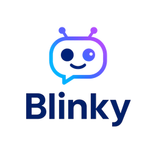

# blinky-engine (AI Agent for Bliwork)



Blinky is a smart conversational agent built with OpenAI’s GPT-4o, designed to simulate a real onboarding person for new hiring. It understands messy customer input and supports with the questions they may have. With natural language understanding, intent detection, and seamless Twilio integration, it’s not just a chatbot — it’s your 24/7 talent team.

## Specs
### Features
- LLM Integration: OpenAI GPT-4 via API (chat & instruction modes)
- Intent Recognition: LLM-based with fallback regex
- Fuzzy Matching: RapidFuzz for detecting questions variations
- Dynamic Prompting: Context-aware prompt construction based on user input and catalog
- Multimodal Communication: Text interaction via different channels.

### Tech Stack
- Framework: FastAPI (Python 3.11)
- Runtime: Uvicorn ASGI server
- Environment Management: dotenv for secure API keys
- OpenAI Client: openai v1 SDK
- Message Delivery: Sandbox or Business API
- Data Storage: CSV for catalog (extendable to PostgreSQL or MongoDB)

### DevOps
- Containerization: Docker with Python slim image
- Orchestration: Kubernetes-ready (Deployment + Service YAMLs)
- Environment Variables: Loaded via Kubernetes secrets

### SRE
- Response Latency: < 5s per message (avg)
- Intention Accuracy: ≥ 90% with GPT-4
- Uptime: ≥ 99.9% (with managed hosting)

### Sec & Privacy
- API keys managed via .env and Kubernetes secrets
- No user data stored by default; logs can be configured externally
- Managed usage policies

## How to run 
**Python 3.9 and up is required to run this service**

### Locally
1. Fetch the repo `git clone <this repo url>`
2. (optional) create an isolated env for run the repo `python -m venv env`
3. Install Dependencies `pip install -r requirements.txt`
4. Generate the `.env`file and configure your credentials. `cp env.sample .env`
5.  Run the code with uvicorn `uvicorn app.main:app --reload --host 127.0.0.1 --port 8000`
6. Send your request by using the following url base and payload:
```
<channel>: whatsapp for send through it, http to direct connect
URL: http://127.0.0.1:8000/chatbot/<channel>
payload
{ 
    'from': '+52XXXXXXXX0',
    'to': '+52XXXXXXXX0',
    'message': 'Your Prompt Text',
    'context': 'conversation if exists'
}
```
**Keep in mind, the chatbot is using Spanish Language**

### locally through docker instance
1. Follow previous 1 through 4 steps for run locally.
2. Build docker image by: `docker build -t blinky .`
3. Deploy docker image by: `docker run -p 8000:8000 blinky`
4. Send your request by using the following url base and payload:
```
<channel>: whatsapp for send through it, http to direct connect
URL: http://127.0.0.1:8000/chatbot/<channel>
payload
{ 
    'from': '+52XXXXXXXX0',
    'to': '+52XXXXXXXX0',
    'message: 'Your Prompt Text',
    'context': 'conversation if exists'
}
```

### locally through k8s cluster
1. Follow previous docker steps but skip the `.env` generation.
2. Update the `k8s/deployment.yml` to point to correct image.
3. Update the `k8s/secrets.yml` with the keys or the cluster-secrets.
3. Run the following 
```shell
kubectl apply -f k8s/secrets.yaml
kubectl apply -f k8s/deployment.yaml
kubectl apply -f k8s/service.yaml
```
4. Send your request by using the following url base and payload:
```
<channel>: whatsapp for send through it, http to direct connect
URL: http://127.0.0.1:8000/chatbot/<channel>
payload
{ 
    'from': '+52XXXXXXXX0',
    'to': '+52XXXXXXXX0',
    'message: 'Your Prompt Text',
    'context': 'conversation if exists'
}
```
### Run tests
`pytest tests/ --tb=short --disable-warnings`

## Business considerations
### Architecture Diagram
TBA
### Components Diagram
TBA
### Prompt Diagram
TBA

### Tech Debts
- Regression Test Suite must be completed for this solution to ensure new versions doesn't have problem with existing solution.
- Conversational must be better implemented to integrate the tokens per session.
- Multiple Keys must be generated to not convert into bottle neck situation.
- More channels needs to be integrated to a fully coverage not only whatsapp.
- More intents needs to be integrate to have more extensive comms.