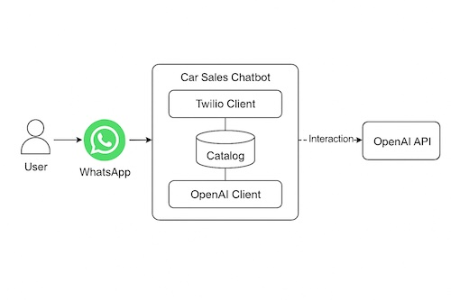
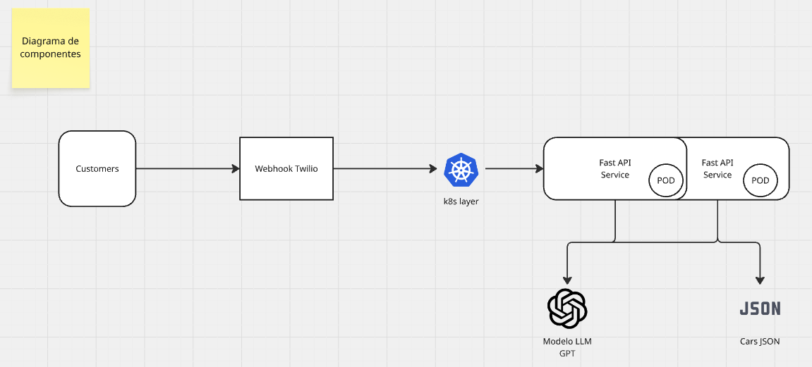
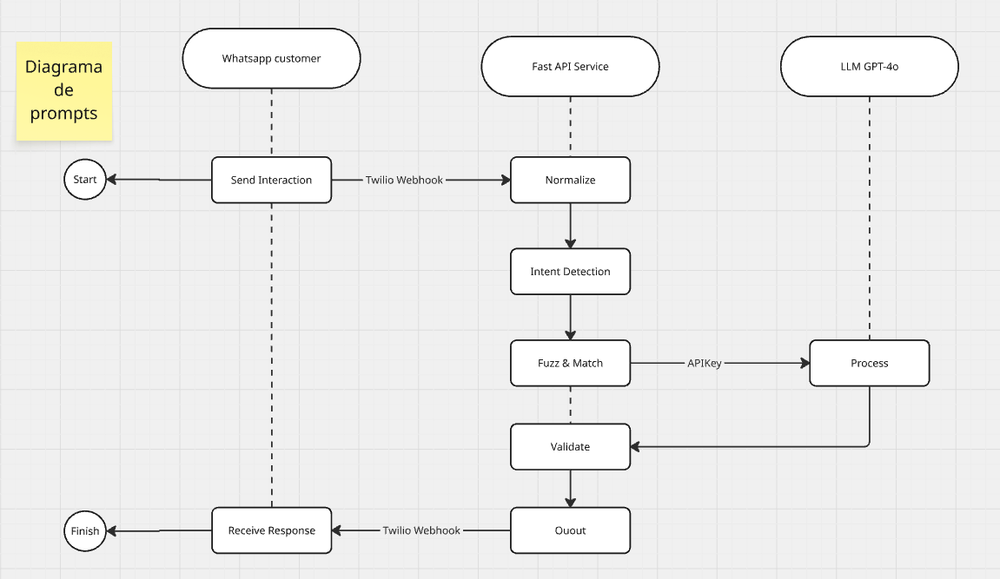
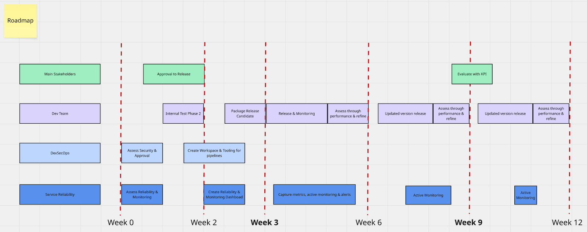

# orange-biscuit (ChatBot for Sales)


KVKy is a smart conversational agent built with OpenAI’s GPT-4o, designed to simulate a real car salesperson via WhatsApp. It understands messy customer inputs, recommends cars from a live catalog, and calculates personalized financing plans in seconds. With natural language understanding, intent detection, and seamless Twilio integration, it’s not just a chatbot — it’s your 24/7 sales team.

Called Orange Biscuit just because you can eat one while speaking with it.

## Specs
### Features
- LLM Integration: OpenAI GPT-4 via API (chat & instruction modes)
- Intent Recognition: LLM-based with fallback regex
- Fuzzy Matching: RapidFuzz for detecting vehicle model variations
- Dynamic Prompting: Context-aware prompt construction based on user input and catalog
- Financing Calculator: Calculates monthly payments based on user-defined terms
- Unique ID Generator: Secure format for lead tracking.
- Multimodal Communication: Text interaction via WhatsApp (Twilio API).

### Tech Stack
- Framework: FastAPI (Python 3.11)
- Runtime: Uvicorn ASGI server
- Environment Management: dotenv for secure API keys
- OpenAI Client: openai v1 SDK
- Message Delivery: Twilio WhatsApp Sandbox or Business API
- Data Storage: CSV for catalog (extendable to PostgreSQL or MongoDB)

### DevOps
- Containerization: Docker with Python slim image
- Orchestration: Kubernetes-ready (Deployment + Service YAMLs)
- Environment Variables: Loaded via Kubernetes secrets

### SRE
- Response Latency: < 5s per message (avg)
- Intention Accuracy: ≥ 90% with GPT-4
- Uptime: ≥ 99.9% (with managed hosting)

### Sec & Privacy
- API keys managed via .env and Kubernetes secrets
- No user data stored by default; logs can be configured externally
- Follows OpenAI and Twilio usage policies

## How to run 
**Python 3.9 and up is required to run this service**

### Locally
1. Fetch the repo `git clone <this repo url>`
2. (optional) create an isolated env for run the repo `python -m venv env`
3. Install Dependencies `pip install -r requirements.txt`
4. Generate the `.env`file and configure your credentials. `cp env.sample .env`
5.  Run the code with uvicorn `uvicorn app.main:app --reload --host 127.0.0.1 --port 8000`
6. Send your request by using the following url base and payload:
```
<channel>: whatsapp for send through it, http to direct connect
URL: http://127.0.0.1:8000/chatbot/<channel>
payload
{ 
    'from': '+52XXXXXXXX0',
    'to': '+52XXXXXXXX0',
    'message: 'Your Prompt Text'
}
```
**Keep in mind, the chatbot is using Spanish Language**

### locally through docker instance
1. Follow previous 1 through 4 steps for run locally.
2. Build docker image by: `docker build -t kvky .`
3. Deploy docker image by: `docker run -p 8000:8000 kvky`
4. Send your request by using the following url base and payload:
```
<channel>: whatsapp for send through it, http to direct connect
URL: http://127.0.0.1:8000/chatbot/<channel>
payload
{ 
    'from': '+52XXXXXXXX0',
    'to': '+52XXXXXXXX0',
    'message: 'Your Prompt Text'
}
```

### locally through k8s cluster
1. Follow previous docker steps but skip the `.env` generation.
2. Update the `k8s/deployment.yml` to point to correct image.
3. Update the `k8s/secrets.yml` with the keys or the cluster-secrets.
3. Run the following 
```shell
kubectl apply -f k8s/secrets.yaml
kubectl apply -f k8s/deployment.yaml
kubectl apply -f k8s/service.yaml
```
4. Send your request by using the following url base and payload:
```
<channel>: whatsapp for send through it, http to direct connect
URL: http://127.0.0.1:8000/chatbot/<channel>
payload
{ 
    'from': '+52XXXXXXXX0',
    'to': '+52XXXXXXXX0',
    'message: 'Your Prompt Text'
}
```
### Run tests
`pytest tests/ --tb=short --disable-warnings`

## Business considerations
### Architecture Diagram

### Components Diagram

### Prompt Diagram

### Roadmap to Production

This roadmap outlines a **12-week release plan** for a digital product involving multiple teams: stakeholders, developers, DevSecOps, and reliability/monitoring teams. The roadmap is structured around key milestones and continuous refinement cycles.

#### Week 0 – Planning & Assessment
- Main Stakeholders aligned on project goals.
- Dev Team and DevSecOps initiate approvals and security assessments.
- Service Reliability starts evaluating monitoring requirements.

#### Week 2 – Internal Testing & Setup
- Dev Team performs Internal Test Phase 2.
- DevSecOps sets up tooling for CI/CD pipelines.
- Service Reliability builds monitoring dashboards.

#### Week 3 – Initial Release
- Packaging of the Release Candidate is completed.
- Initial release and system monitoring begins.
- Metrics, alerts, and monitoring are captured in real-time.

#### Week 6 – First Update Cycle
- First updated version is released.
- All teams refine the system based on performance feedback.
- Monitoring continues actively.

#### Week 9 – KPI Evaluation
- Stakeholders evaluate the product with key KPIs.
- Second updated version is released.
- Teams continue refining based on performance insights.

#### Week 12 – Final Refinement
- Third updated version is released.
- Final refinements and performance assessments are made.
- Active monitoring continues through the end of the cycle.

From week 12 we have enough data to refine the bot, iterates and improve it or decide to replace it.

### How to evaluate the bot
Evaluating the efficiency of this bot requires measuring its technical performance and its impact on user experience and conversion.

#### On Tech Perspective:
- Response Time:	Log from request → response	< 2 seconds
- Availability:	Uptime / 5xx error rate	≥ 99.9%
- Intent Accuracy:	% of correctly classified intents	≥ 90%
- Parsing Errors:	Failures when extracting parameters (e.g., years)	≤ 5%

#### On Buiness Side:
- Conversion:	Did the user request financing or useful info?
- Interactions per Session:	How many messages before solving the query
- Leads Generation: How many leads is generating for sales
- CSAT (Satisfaction):	Rating emoji or quick survey at the end
- NPS (Recommendation):	Direct question: “Would you recommend this?”

### Tech Debts
- Regression Test Suite must be completed for this solution to ensure new versions doesn't have problem with existing solution.
- Conversational must be better implemented to integrate the tokens per session.
- Multiple Keys must be generated to not convert into bottle neck situation.
- More channels needs to be integrated to a fully coverage not only whatsapp.
- More intents needs to be integrate to have more extensive comms.